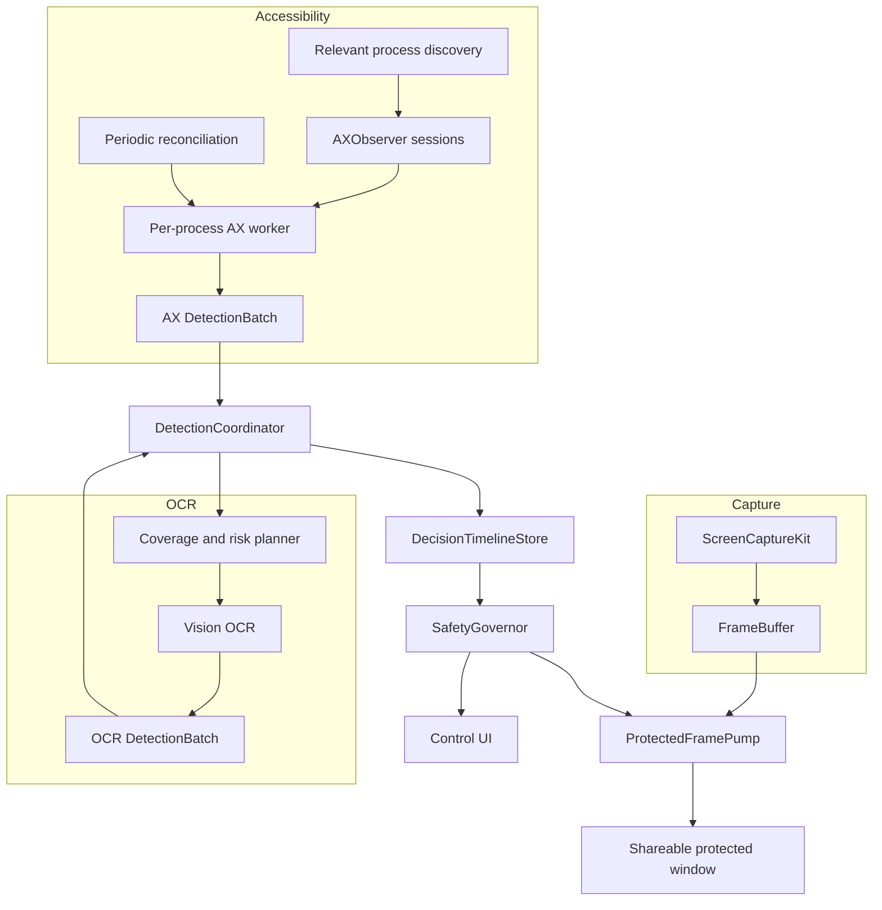

# Accessibility-first detection architecture

Status: Proposed
Repository: `pc-style/PII-Stream-Guard`
Reviewed against: `main`, 2026-07-11

## 1. Decision

PII Stream Guard should make macOS Accessibility the primary semantic detector for supported applications.

It should not make Accessibility the only universal detector.

The target design is:

- Accessibility first for exact text, element roles, focus, and geometry.
- Vision OCR as a selective fallback and audit mechanism.
- Accessibility-only as an explicit limited-coverage mode.
- OCR-only as a compatibility mode.
- A delayed protected output as the viewer-safety boundary.
- Full-frame blackout as the initial safe action when a finding or uncertainty exists.
- Precise masks only after geometry is aligned to the exact buffered frame interval.

This design reduces routine OCR work without pretending that the Accessibility tree is a complete representation of every rendered pixel.

## 2. Current-state finding

The repository already includes an Accessibility scanner, Vision OCR, a delayed output, and fail-closed behavior in parts of the output path. The problem is orchestration.

### Current flow

```text
5 Hz timer
  -> scan visible AX trees
  -> store latest AX boxes

OCR scheduler
  -> process captured frame with Vision
  -> merge fresh AX boxes
  -> update guard state and BoxStore
  -> delayed output reads BoxStore
```

Consequences:

1. AX is not an independent decision source.
2. An AX match waits for another OCR processing pass before it can arm protection.
3. Full visible-tree scans repeat even when only one element changed.
4. A large or slow AX tree can consume most of the scan wall-clock budget.
5. AX coverage is implicit. An empty result can mean clear, unsupported, timed out, stale, or inaccessible.
6. Current guard modes combine detector quality, OCR cadence, render delay, and mask behavior, making safety policy hard to reason about.
7. The control UI is a small preview-window toolbar launched through the CLI rather than a full macOS application workflow.

The observed 1 to 2 second delay requires measurement before assigning one cause. The current design is nevertheless guaranteed to add unnecessary coupling because AX cannot publish a protection decision on its own.

## 3. Safety model

### 3.1 The output is delayed, not predictive

The system cannot inspect future content. It can delay outgoing frames:

```text
local source time:       t
viewer release time:     t + outputDelay
detection deadline:      before t + outputDelay
```

A 2 second buffer gives the detector and action pipeline a budget before the captured frame reaches viewers.

### 3.2 Required invariant

For every outgoing frame, exactly one of these must be true:

- a fresh clear decision covers that frame time;
- a fresh mask decision with valid geometry covers that frame time;
- the frame is fully blacked out.

No decision, stale decision, partial coverage, timestamp gap, or negative safety margin means blackout.

### 3.3 Accessibility coverage is not a Boolean

Permission is necessary but not sufficient. Coverage must include:

- whether the process can be queried;
- whether observers are registered;
- whether notifications are arriving;
- whether relevant visible windows expose meaningful elements;
- whether text and geometry can be read;
- whether the latest state is fresh enough for the target frame;
- whether the process is timing out;
- whether an OCR audit disagrees.

### 3.4 Whole-frame blackout first

Applying a newly detected rectangle to a historical buffered frame can be wrong if the UI moved between capture and detection. Whole-frame blackout avoids this alignment error and should be the default first release.

Precise masks require a timestamped geometry timeline:

```text
region R valid during [t0, t1)
frame F captured at tf
apply R only when tf is inside [t0, t1)
```

Critical secrets should still be allowed to force full blackout after precise masking exists.

## 4. Target data flow



## 5. Component design

### 5.1 `AccessibilityProcessRegistry`

Responsibilities:

- Discover PIDs whose visible windows intersect the selected capture source.
- Track process launch and exit.
- Track window creation, destruction, movement, and target intersection.
- Start and stop one `AccessibilityObserverSession` per relevant PID.
- Exclude the PII Stream Guard process.
- Publish process/window coverage changes.

A display target can include several PIDs. A window target usually has one owning PID but can still move or be replaced.

### 5.2 `AccessibilityObserverSession`

Owns all AX interaction for one PID.

Responsibilities:

- Create an application `AXUIElement`.
- Create an `AXObserver`.
- Add the observer run-loop source to a dedicated run loop.
- Register supported notifications.
- Perform one bounded bootstrap scan.
- Coalesce bursts before targeted extraction.
- Apply `AXUIElementSetMessagingTimeout`.
- Track timeout/error counts.
- Open a circuit after repeated failures.
- Periodically attempt recovery.
- Remove notifications and invalidate state on exit.

Do not run AX calls on `MainActor`.

Do not move live `AXUIElement` references between unrelated actors. Extract immutable snapshots on the session worker.

Proposed coalescing defaults to benchmark:

```text
normal value/focus burst: 25 to 50 ms
window move/resize burst: 50 to 100 ms
reconciliation interval while strict: 1 s
reconciliation interval while idle: 3 to 5 s
per-call messaging timeout: 50 to 100 ms
```

These are starting hypotheses, not fixed performance claims.

### 5.3 `AXSnapshotExtractor`

Extract only useful visible content.

Preferred order:

1. Event element when supplied by the notification.
2. Focused element or focused window.
3. Visible children.
4. Visible character range for large text controls.
5. Bounded subtree.
6. Bounded window reconciliation.
7. Full relevant-process reconciliation only as a last resort.

For each extracted span:

```swift
struct SemanticTextSpan: Sendable {
    let stableElementKey: ElementKey
    let pid: pid_t
    let windowID: CGWindowID?
    let role: String
    let subrole: String?
    let text: String
    let globalBounds: CGRect?
    let observedAt: ContinuousClock.Instant
    let geometryConfidence: GeometryConfidence
}
```

The stable key should be an ephemeral session identifier. Do not persist a serialized AX element or full tree.

AX and OCR must both use the repository's shared `PIIClassifier`. Email detection uses the classifier's existing compact and whitespace-tolerant regular expressions. Custom needles are lowercased and have whitespace removed before matching, exactly as `NormalizedText` and `PIIClassifier` do today.

Normalization must retain a character map back to the original `String.Index` values. A normalized needle match is converted to its original raw-text range before geometry lookup. Email matches already originate as raw-text ranges and use those ranges directly. The original range is passed through `RecognizedTextFragment.boundingBoxForRange` to `kAXBoundsForRangeParameterizedAttribute`, and the returned bounding box stays attached to the resulting finding. Geometry lookup must never use offsets from normalized text against the original AX value.

For a matched substring, prefer `kAXBoundsForRangeParameterizedAttribute`. If unsupported:

- single-line text may use a proportional estimate marked low-confidence;
- multi-line or ambiguous text should use the whole element bounds;
- critical findings or low-confidence geometry should force full blackout.

### 5.4 Secure text fields

Check `kAXSecureTextFieldSubrole` before reading value-like attributes.

Policy:

- Never read or retain the secret value.
- Never log the value.
- Publish only a `secureInputPresent` region signal if policy needs it.
- Optional strict policy can black out the field or entire window.
- A secure field is not proof that a secret is visually exposed, because the app may render bullets. The action must be configurable and conservative.

### 5.5 `CoverageTracker`

Maintain coverage by process/window and for the selected source as a whole.

```swift
enum CoverageState: Sendable, Equatable {
    case trusted
    case partial(CoverageReason)
    case unknown(CoverageReason)
    case stale
    case unavailable(CoverageReason)
}
```

Inputs:

- permission status;
- observer registration;
- latest successful extraction;
- latest successful reconciliation;
- visible-window inventory;
- extraction result count and supported attributes;
- timeouts and AX errors;
- OCR audit disagreement;
- source selection changes.

Rules:

- `no findings` is not a coverage state.
- A timeout is never clear.
- A permission denial is unavailable.
- An app with visible pixels but no meaningful AX structure is partial or unknown.
- If the state expires before a delayed frame release, fail closed.
- In Hybrid, partial/unknown regions enter the OCR queue.
- In Accessibility-only, partial/unknown source coverage blackouts strict output.

### 5.6 `DetectionCoordinator`

AX and OCR publish independently:

```swift
struct DetectionBatch: Sendable {
    let source: PIIDetectionSource
    let observedAt: ContinuousClock.Instant
    let validFrom: ContinuousClock.Instant
    let coverage: CoverageState
    let findings: [DetectionFinding]
}
```

The coordinator:

- runs category/severity policy;
- merges or reconciles source findings;
- controls hysteresis;
- converts findings and coverage into protection decisions;
- publishes to a timeline;
- never needs to wait for an OCR frame to accept AX results.

`validFrom` is conservative:

- observer event: event receipt minus an uncertainty lookback;
- bootstrap/reconciliation finding: last known clear boundary;
- OCR finding: source frame timestamp;
- coverage loss: last known valid coverage timestamp.

This allows a later result to protect earlier frames that are still buffered.

### 5.7 `DecisionTimelineStore`

The current output reads snapshots according to target time. The new store must support decisions inserted after their `effectiveFrom`.

```swift
struct ProtectionDecision: Sendable {
    enum Action: Sendable, Equatable {
        case clear
        case mask([NormalizedRect])
        case blackout(BlackoutReason)
    }

    let effectiveFrom: ContinuousClock.Instant
    let effectiveUntil: ContinuousClock.Instant?
    let action: Action
    let sources: Set<PIIDetectionSource>
    let coverage: CoverageState
}
```

Required operations:

- insert or replace an interval;
- query the strongest decision covering a frame timestamp;
- prune intervals older than the frame buffer plus a margin;
- preserve monotonic source timestamps;
- resolve overlapping decisions by severity, freshness, and fail-closed policy;
- expose gaps as blackout.

Test retroactive insertion directly.

### 5.8 `OCRFallbackScheduler`

Hybrid should not simply turn OCR off whenever AX permission exists.

Schedule OCR for:

- visible windows with partial or unknown AX coverage;
- canvas, game, video, remote desktop, and custom-drawn regions;
- stale AX sessions;
- AX/OCR disagreement;
- critical app profiles;
- periodic audits;
- geometry confirmation for an ambiguous critical finding.

Work-reduction strategy:

- changed tiles at useful source resolution;
- risk-ranked regions;
- temporal OCR cache;
- low-rate full coverage sweep;
- accurate re-read only for uncertain high-risk candidates.

In Accessibility-only, the scheduler must be disabled and tests must verify zero Vision requests.

### 5.9 `SafetyGovernor`

Inputs:

- configured output delay;
- AX event-to-decision p95/p99;
- OCR frame-to-decision p95/p99;
- decision lookup time;
- render and transport jitter;
- frame-buffer health;
- coverage state;
- clock continuity.

Calculation:

```text
requiredDelay =
    worstRelevantDetectionP99
    + decisionP99
    + renderTransportP99
    + conservativeMargin

safetyMargin = configuredDelay - requiredDelay
```

Rules:

- Negative or unknown margin means blackout.
- Buffer underrun means blackout.
- Decision timeline gap means blackout.
- Every frame must have a fresh decision that covers its capture timestamp before release. A missing or late decision means immediate blackout even when the configured delay has a positive measured margin.
- Permission revocation means blackout in strict Hybrid or Accessibility-only.
- A user cannot force a green status by selecting an unsafe delay.
- Local diagnostics may show an override, but strict protected output remains closed.

Percentile measurements size the configured delay and provide telemetry. They never authorize release of an individual frame.

The proposed initial strict preset is 2.0 seconds. Later, measured adaptive delay may reduce this.

## 6. Mode definitions

### 6.1 Hybrid

Default mode.

```text
AX healthy:
    use AX as primary
    run sparse OCR audits

AX partial/unknown:
    OCR affected regions
    remain black until a fresh decision covers the delayed frame

source disagreement:
    blackout
    schedule confirmation
```

Benefit: lower CPU and faster semantic response on cooperative apps, with pixel coverage retained elsewhere.

### 6.2 Accessibility-only

Explicit advanced mode.

```text
Vision OCR requests: 0
AX coverage trusted and fresh: evaluate normally
AX coverage partial/unknown/stale/unavailable: blackout strict output
```

UI copy must state that this mode cannot inspect every visual surface.

Potential use cases:

- controlled native-app workflow;
- low-energy mode with a known app allowlist;
- a user who prefers fail-closed blackout over OCR cost;
- development and AX benchmarking.

It must not be marketed as complete desktop protection.

### 6.3 OCR-only

Compatibility mode.

- No Accessibility permission required.
- Existing Vision pipeline remains available.
- Useful for canvas, game, remote desktop, VM, or troubleshooting.
- Still requires delayed output for viewer-safe guarantees.

## 7. Runtime policy separation

Current guard modes mix concerns. Replace them with orthogonal settings:

```swift
struct RuntimePolicy: Sendable {
    var detectionMode: DetectionMode
    var outputDelayPolicy: OutputDelayPolicy
    var maskPolicy: MaskPolicy
    var safetyPolicy: SafetyPolicy
    var ocrPolicy: OCRPolicy
    var hysteresisPolicy: HysteresisPolicy
}
```

Example UI presets may populate these values, but core code must not infer delay solely from OCR mode.

Proposed presets:

| Preset | Detection | Delay | Uncertainty | Action |
|---|---|---:|---|---|
| Recommended | Hybrid | adaptive, min 2.0 s initially | fail closed | blackout first |
| AX only | Accessibility-only | min 2.0 s initially | fail closed | blackout |
| Pixel compatibility | OCR-only | measured | fail closed | blackout or verified mask |
| Diagnostics | selectable | explicit | visible warning | boxes allowed |

## 8. Native macOS application

### 8.1 Packaging direction

Keep:

- `PIIStream` core library;
- `pii-stream` CLI;
- automation and benchmark commands.

Add:

- a proper signed macOS app target;
- application bundle metadata and entitlements;
- control window;
- menu-bar status;
- first-run permission flow;
- source picker;
- native settings;
- separate shareable protected-output window.

The control window must not be the same window viewers capture.

### 8.2 First run

1. Product explanation.
2. Use case: screen share or stream.
3. Screen Recording permission.
4. Detection mode.
5. Accessibility permission when required.
6. Source selection.
7. Detector packs and custom phrases.
8. Output delay and fail-closed explanation.
9. Synthetic safety test.
10. Open protected output.

### 8.3 Main dashboard

Display:

- selected source;
- running state;
- detection mode;
- output delay;
- measured required delay;
- safety margin;
- AX permission;
- observer health;
- coverage;
- OCR fallback rate;
- output state;
- last synthetic test;
- emergency blackout.

Status values:

```text
OFF
STARTING
CLEAR
MASKING
BLACKOUT
UNSAFE MARGIN
PERMISSION REQUIRED
COVERAGE UNKNOWN
```

No generic green icon when coverage or safety margin is unknown.

### 8.4 Settings

- Detector packs.
- Custom phrases/patterns.
- App-specific profiles.
- Accessibility-only allowlist for controlled workflows.
- Delay and mask policy.
- Strict fail-closed toggle, on by default for protected output.
- Privacy-safe diagnostics.
- Advanced config import/export.
- CLI command preview for reproducibility.

## 9. Privacy design

Accessibility permission is powerful. The app must minimize collection.

Default:

- local processing only unless the user explicitly selects server-client mode;
- no raw tree persistence;
- no raw text persistence;
- no screenshot persistence;
- no full matched value in notifications or logs;
- session-scoped salted fingerprint for deduplication;
- category, rule ID, severity, app/window, timing, and rectangle count only;
- explicit temporary debug mode with a visible indicator and automatic expiry.

Review `PIIBox.matched`, Codable metadata, recording sidecars, JSON events, status output, and crash diagnostics. A model containing the full match should not automatically become a persistent or IPC payload.

Server-client mode sends encoded frames to the configured processor and receives protected frames or detection metadata, so the UI must disclose that processing is no longer local. Its authentication token is secret: accept it only through the explicit runtime configuration, retain it in process memory for the session, and never include it in logs, JSON events, recordings, diagnostics, or error strings. Remote disconnects, request timeouts, authentication failures, malformed responses, and protocol-version mismatches invalidate every unverified frame still in the delay buffer and produce black-frame output until a fresh authenticated response restores coverage.

## 10. Failure handling

| Failure | Hybrid | Accessibility-only | OCR-only |
|---|---|---|---|
| AX permission denied | OCR fallback, UI warning | blackout | unaffected |
| AX observer registration fails | OCR affected app, warning | blackout | unaffected |
| AX process timeout | OCR affected app, circuit breaker | blackout | unaffected |
| AX empty but coverage unknown | OCR affected app | blackout | unaffected |
| OCR fails | blackout uncovered regions/source | not used | blackout |
| Decision timeline gap | blackout | blackout | blackout |
| Frame buffer underrun | blackout | blackout | blackout |
| Negative safety margin | blackout | blackout | blackout |
| Secure field encountered | policy mask/blackout, no value read | policy mask/blackout, no value read | pixel policy |
| Source changes unexpectedly | re-bootstrap, blackout until covered | re-bootstrap, blackout | OCR reinitialize, blackout |
| Remote disconnect or timeout | blackout retained unverified frames | blackout retained unverified frames | blackout retained unverified frames |
| Remote authentication failure | blackout, require valid private token | blackout, require valid private token | blackout, require valid private token |
| Malformed or incompatible remote response | discard response, blackout | discard response, blackout | discard response, blackout |

## 11. Instrumentation

Use monotonic time.

Required spans:

- AX notification received;
- coalescing started/ended;
- AX extraction started/ended;
- classifier started/ended;
- decision inserted;
- source frame captured;
- delayed frame selected;
- decision resolved;
- frame rendered;
- frame recorded/sent.

Report:

- event-to-decision p50/p95/p99;
- OCR frame-to-decision p50/p95/p99;
- decision lookup p99;
- output delay and safety margin;
- AX calls/timeouts per PID;
- observer health;
- reconciliation duration;
- OCR requests and pixels per second;
- blackout duration and reason;
- timeline gaps;
- main-thread longest stall.

No raw sensitive value is needed for these metrics.

## 12. Test strategy

### 12.1 Synthetic AX fixture app

Add a small test application exposing:

- AppKit static text;
- text field;
- text view;
- table and outline;
- SwiftUI text and fields;
- secure field;
- rapidly changing text;
- window movement;
- element creation/destruction;
- intentionally large hierarchy;
- delayed AX response if practical.

Fixtures include valid email, phone, token-like custom phrase, negative controls, and text split across elements.

### 12.2 Unit tests

- Coverage state transitions.
- Empty result versus unknown coverage.
- Event coalescing.
- Timeout circuit breaker.
- Secure-field exclusion.
- `validFrom` calculation.
- Retroactive decision insertion.
- Overlap/severity resolution.
- Timeline pruning.
- Fail-closed gap behavior.
- Hysteresis and clear confirmation.
- Zero Vision calls in Accessibility-only.

### 12.3 Integration tests

- AX event arms without OCR.
- AX observer loss triggers fallback or blackout.
- Permission revocation while running.
- Hybrid OCR fallback for a custom-drawn window.
- Two-second buffer catches a finding before release.
- Finding discovered after deadline produces blackout and unsafe-margin telemetry.
- Multi-display coordinate mapping.
- Window moves while buffered.
- Protected output is shareable and control UI is excluded.

### 12.4 App matrix

- Native AppKit.
- Native SwiftUI.
- Safari/Chromium page.
- Electron app.
- Terminal.
- Code editor.
- Canvas/custom-drawn app.
- Remote desktop.
- Video/game surface.
- Password manager or synthetic secure-field equivalent.

Do not hard-code a coverage claim for any app category until tests establish it.

## 13. Proposed gates

Targets for an agreed Apple Silicon reference machine:

- AX event to decision p95 at or below 100 ms.
- AX event to decision p99 at or below 250 ms.
- No steady-state 5 Hz full-tree traversal.
- Main thread is not used for AX extraction or classification.
- Hung PID cannot stall another PID.
- Accessibility-only creates zero Vision requests.
- Hybrid stable native workload materially reduces OCR requests and CPU.
- Every released delayed frame has a covering decision.
- Unknown or negative margin never reports protected.
- No raw sensitive text in default persistent diagnostics.

These are validation targets, not current performance claims.

## 14. Repository changes

Likely touchpoints:

```text
Sources/pii-stream/AccessibilityDetection.swift
Sources/pii-stream/AppCoordinator.swift
Sources/pii-stream/FrameProcessor.swift
Sources/pii-stream/ProtectedFramePump.swift
Sources/pii-stream/RuntimeModes.swift
Sources/pii-stream/Models.swift
Sources/pii-stream/CLI.swift
Sources/pii-stream/PreviewWindow.swift
Sources/pii-stream-cli/main.swift
Package.swift
Tests/pii-streamChecks
```

Suggested new files/types:

```text
AccessibilityProcessRegistry.swift
AccessibilityObserverSession.swift
AXSnapshotExtractor.swift
CoverageTracker.swift
DetectionCoordinator.swift
DecisionTimelineStore.swift
SafetyGovernor.swift
RuntimePolicy.swift
MacApp/
SyntheticAXFixture/
```

Names are proposals. Prefer fitting the existing project organization over adding unnecessary layers.

## 15. Pull request sequence

1. Independent detection batches and retroactive decision timeline.
2. Event-driven AX observer sessions and bounded reconciliation.
3. Coverage model and source-based modes.
4. Selective OCR fallback and audit scheduling.
5. Configurable delayed output and safety governor.
6. Native macOS control application.
7. Geometry timeline and precise masks.

Each PR must include regression tests and latency instrumentation. Do not combine the entire migration into one unreviewable change.

## 16. Source references

Current repository:

- <https://github.com/pc-style/PII-Stream-Guard>
- <https://github.com/pc-style/PII-Stream-Guard/blob/main/Sources/pii-stream/AccessibilityDetection.swift>
- <https://github.com/pc-style/PII-Stream-Guard/blob/main/Sources/pii-stream/AppCoordinator.swift>
- <https://github.com/pc-style/PII-Stream-Guard/blob/main/Sources/pii-stream/FrameProcessor.swift>
- <https://github.com/pc-style/PII-Stream-Guard/blob/main/Sources/pii-stream/ProtectedFramePump.swift>
- <https://github.com/pc-style/PII-Stream-Guard/blob/main/Sources/pii-stream/RuntimeModes.swift>
- <https://github.com/pc-style/PII-Stream-Guard/blob/main/Sources/pii-stream/CLI.swift>
- <https://github.com/pc-style/PII-Stream-Guard/blob/main/Sources/pii-stream/PreviewWindow.swift>

Apple documentation:

- <https://developer.apple.com/documentation/applicationservices/1460133-axobservercreate>
- <https://developer.apple.com/documentation/applicationservices/1462089-axobserveraddnotification>
- <https://developer.apple.com/documentation/applicationservices/1459139-axobservergetrunloopsource>
- <https://developer.apple.com/documentation/applicationservices/1459345-axuielementsetmessagingtimeout>
- <https://developer.apple.com/documentation/applicationservices/kaxvaluechangednotification>
- <https://developer.apple.com/documentation/applicationservices/kaxselectedtextchangednotification>
- <https://developer.apple.com/documentation/applicationservices/kaxfocuseduelementchangednotification>
- <https://developer.apple.com/documentation/applicationservices/kaxvisiblechildrenattribute>
- <https://developer.apple.com/documentation/applicationservices/kaxvisiblecharacterrangeattribute>
- <https://developer.apple.com/documentation/applicationservices/kaxboundsforrangeparameterizedattribute>
- <https://developer.apple.com/documentation/applicationservices/kaxsecuretextfieldsubrole>
- <https://developer.apple.com/documentation/applicationservices/1459186-axisprocesstrustedwithoptions>
